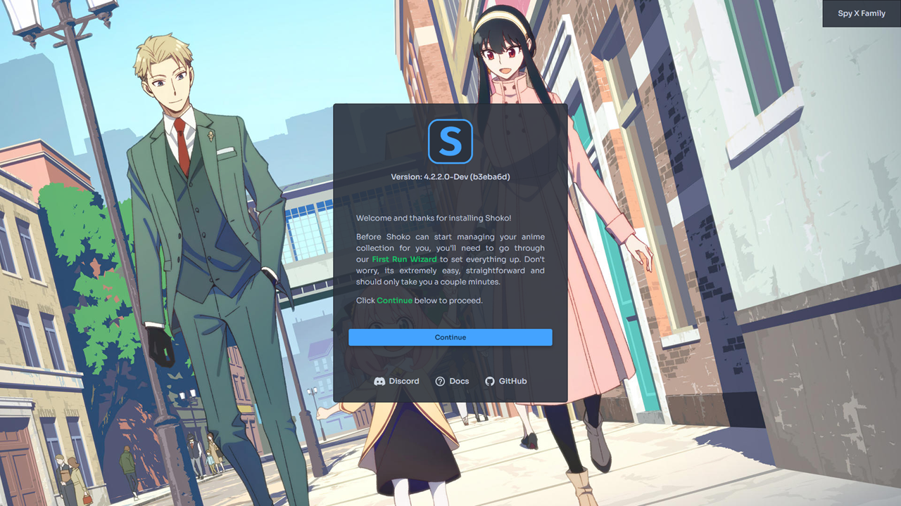
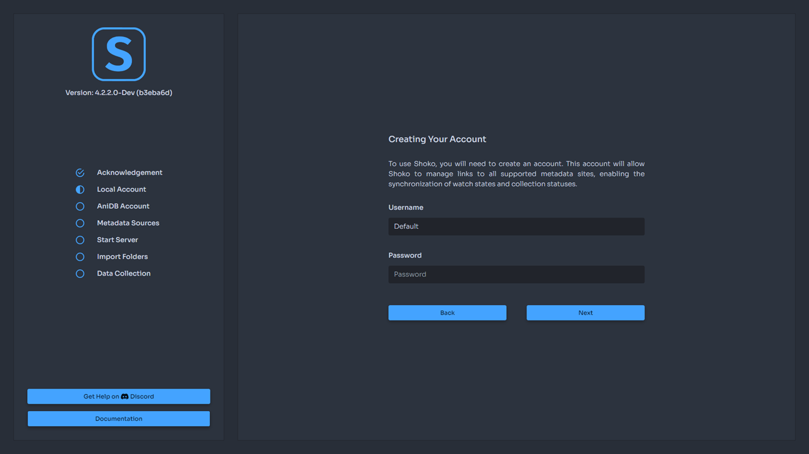
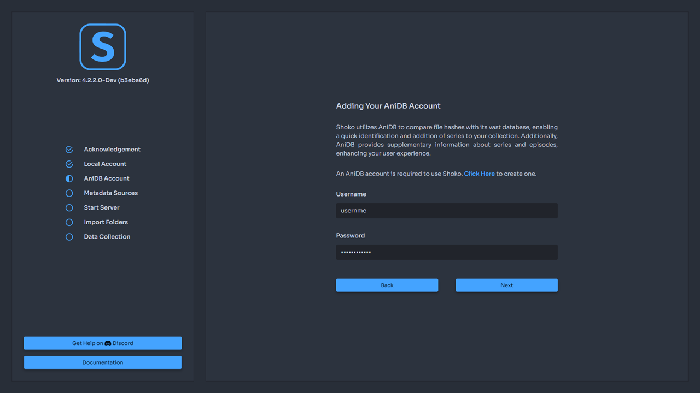

With Shoko Server installed, the next step is configuring it but first, you'll need to make sure Shoko Server is running.

Windows users can check their **system tray** for the Shoko icon and if not there, simply launch Shoko Server.

Docker users will need to run the command to launch the container, and while the exact command will be different per person, it should look something like this.

```sh
docker run -d --name shokoserver --restart always -p 8111:8111 -v "$HOME/.shoko:/home/shoko/.shoko" -v "/path/to/anime:/mnt/anime" -v "/path/to/import:/mnt/import" -e PUID=$UID -e PGID=$GID shokoanime/server:latest
```

With Shoko Server running, open your browser and navigate to [http://localhost:8111/](http://localhost:8111/) to view the Web UI. If Shoko Server is on a different computer, replace **localhost** with the IP address for of the computer Shoko Server is on.

If successful, you should be greeted by the following.



A default background image is used for First Run. Once you start building your collection, the background image will be pulled from images downloaded for your collection.

## Local Account

You'll need to create an account to use Shoko. This account will allow Shoko to manage links to all supported metadata sites, enabling the synchronization of watch states and collection status.



There are no password requirements for your local account. However, we **highly** recommend saving your login information as we currently do not provide a user-friendly way to reset your password. If you do happen to forget it, check the [Frequently Asked Questions](../faq) page for information on how to reset it.

## AniDB Account

Shoko utilizes AniDB to compare your file hashes with its vast database, enabling a quick identification and addition of series to your collection.



### What is AniDB?

AniDB is a **free** comprehensive anime database and file tracker used extensively by Shoko to provide metadata for the series and files in your collection. At this time, **AniDB is required** to use Shoko which means you'll need to create an account if you don't already have one. If you're unsure about how AniDB operates, take a look at the [AniDB Policies](https://anidb.net/policy) page for how they operate and what they do with the data sent to them.