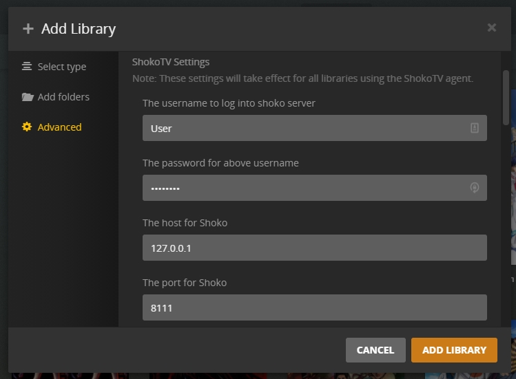

import EasyTable from "../../../components/EasyTable/EasyTable";
import { Steps } from '@astrojs/starlight/components';

If you chose Shoko Relay as your Agent/Scanner combo you can skip this page and move directly to the [Configuring Shoko Relay](../configuring-shoko-relay) page.

#### Creating A Shoko Metadata Library

<Steps>
1. Add a Plex Library
    - While Shoko Server is running, open Plex and create a new "TV Shows" or "Movies" library.
    - Ensure that you have completed the **required edits** mentioned on the [Installing Agents & Scanners](../installing-agents-scanners/#editing-shoko-relay-scannerr) page.

2. Add a Folder to Your Library
    - When prompted to add folders to your library, browse to your anime collection.
    - Even though Shoko will provide the metadata, Plex still needs to know where the physical files are located.

3. Configure the Advanced Settings
    - In the Advanced tab, if you're adding a TV library, select: Scanner **Shoko Series Scanner** and Agent **ShokoTV**.
    - If you're adding a movie library instead, choose: Scanner **Shoko Movie Scanner** and Agent **ShokoMovies**.
    - Enter your Shoko Server credentials which are the only required settings.
    

    For more information on each of the required settings consult the table below:

    <EasyTable
      columns={[
        { name: 'Option', header: 'Option' },
        { name: 'Description', header: 'Description' }
      ]}
      data={[
        {
          Option: "Username",
          Description: "The username for the **local account** you created during the **First Run** setup in Shoko Server."
        },
        {
          Option: "Password",
          Description: "The password for the **local account** you created during the **First Run** setup in Shoko Server."
        },
        {
          Option: "Server IP",
          Description: "The IP address for the computer where Shoko Server is located. This can be left blank unless Shoko Server is running on a different computer."
        },
        {
          Option: "Port",
          Description: "The port Shoko Server uses, by default it's **8111**"
        },
        {
          Option: "Use Single Season Ordering",
          Description: "If you set **SingleSeasonOrdering** to True during the install process, make sure you check this box."
        }
      ]}
    />

5. Add the Library
    - Once you’ve reviewed and configured the remaining options, click the **Add Library** button.
    - After adding the library, initiate a scan within Plex and wait for Plex to add your collection.
</Steps>
