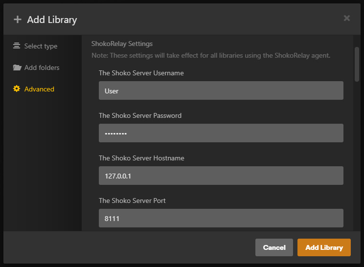

import EasyTable from "../../../components/EasyTable/EasyTable";
import { Steps } from '@astrojs/starlight/components';

If you chose Shoko Metadata as your Plex Agent/Scanner combo you can skip this page and move directly to the [Syncing Watched States](../syncing-watched-states) page.

#### Creating A Shoko Relay Library

<Steps>
1. Add a Plex Library
    - While Shoko Server is running, open Plex and create a new "TV Shows" library.
    - Ensure that you have completed the **required edits** mentioned on the [Installing Agents & Scanners](../installing-agents-scanners/#editing-shoko-relay-scannerr) page.

2. Add a Folder to Your Library
    - When prompted to add folders to your library, browse to your anime collection.
    - Even though Shoko will provide the metadata, Plex still needs to know where the physical files are located.

3. Configure the Advanced Settings
    - In the Advanced tab, select: Scanner **Shoko Relay Scanner** and Agent **ShokoRelay**.
    - Enter your Shoko Server credentials which are the only required settings.
    

    For more information on each of the required settings consult the table below:

    <EasyTable
        header={["Option", "Description"]}
        data={[
          [
            "The Shoko Server Username",
            "The username for the **local account** you created during the **First Run** setup in Shoko Server."
          ],
          [
            "The Shoko Server Password",
            "The password for the **local account** you created during the **First Run** setup in Shoko Server."
          ],
          [
            "The Shoko Server Server Hostname",
            "The IP address for the computer where Shoko Server is located. This can be left blank unless Shoko Server is running on a different computer."
          ],
          [
            "The Shoko Server Port",
            "The port Shoko Server uses, by default it's **8111**"
          ],
          [
            "Use Single Season Ordering *Not Recommended*",
            "If you set **SingleSeasonOrdering** to True during the install process, make sure you check this box."
          ]
        ]}
        columnWidths={{ Option: "30%", Description: "70%" }}
    />

4. Change Recommended Options

    Changing the following options at the bottom of Advanced Settings page is also recommended:

    <EasyTable
        header={["Option", "Setting"]}
        data={[
          [
            "Collections",
            "Hide items which are in collections"
          ],
          [
            "Seasons",
            "Hide for single-season series"
          ]
        ]}
        columnWidths={{ Option: "30%", Setting: "70%" }}
    />

5. Add the Library
    - Once you’ve reviewed and configured the remaining options, click the **Add Library** button.
    - After adding the library, initiate a scan within Plex and wait for Plex to add your collection.
6. Allow Local Metadata
    - In Plex Navigate to: `Settings > Agents > Shows > ShokoRelay`
    - Move the following entry to the top of the list and enable it:
    - [x] Local Media Assets (TV)
</Steps>

### Recommended Shoko Server Configuration
Enable the following options in Shoko to ensure that Plex has at least one source of metadata for everything:
- `Settings > AniDB > Download Options`
  - [x] Character Images
  - [x] Creator Images
- `Settings > Metadata Sites > TMDB Options`
  - [x] Auto Link
  - [x] Auto Link Restricted
  - [x] Download Backdrops
- `Settings > Collection > Relation Options`
  - [x] Auto Group Series
  - [x] Determine Main Series Using Relation Weighing

## Additional Information
### Troubleshooting
When encountering any issues with the scanner or agent, please note that there are detailed logs available in the [Plex Media Server Logs Folder](https://support.plex.tv/articles/200250417-plex-media-server-log-files/) which can help to pinpoint any issues:
- Agent Logs: `\Plex Media Server\Logs\PMS Plugin Logs\com.plexapp.agents.shokorelay.log`
- Scanner Logs: `\Plex Media Server\Logs\Shoko Relay Scanner.log`

:::tip[Important]
When encountering bad matches/metadata the first thing to check for is if TMDB match and episode mapping is correct in Shoko for the series in question.
:::

:::caution[Warning]
Under extremely specific circumstances Plex will automatically group files together without user intervention. This occurs when storing all of the files from multiple AniDB entries in a single folder (located in the root directory of the Plex library) with no other subfolders present inside of it. To resolve this simply create an empty subfolder in any directory affected by this or separate the files from each AniDB series into their own folders/subfolders.
:::

### Handling "Stuck" Metadata

In cases where metadata (generally posters) won't update there is a quick 3 step process to fix it:

1. Navigate to the series > More "..." Button > Unmatch
2. Settings > Manage > Troubleshooting > Clean Bundles + Optimize Database
3. Navigate back to the series > More "..." Button > Match > Select top result

If this somehow still fails then a full [Plex Dance](https://forums.plex.tv/t/the-plex-dance/197064) is likely required.

### Cast & Crew Limitations
If "staff listings" are enabled in the settings the following custom agent limitations apply:
- All Cast & Crew members are listed under the cast section only
- Directors, Producers and Writers will be empty when attempting to filter for them in Plex
- All Crew members are available for filtering under Actor only
- The links in the Cast & Crew section under individual episodes won't return any results

### Automatic Season Naming Limitations
Due to custom agent limitations certain season names which contain special files will not name themselves correctly. These can be renamed manually or with the included [force-metadata.py](../shoko-relay-utility-scripts) script that accesses the Plex API. The affected season names and their intended names are listed below:
- Season -1 → Credits **OR** [Unknown Season] → Credits
- Season -2 → Trailers
- Season -3 → Parodies
- Season -4 → Other

### Automatic Title Modification
##### Common Prefixes for Series
When a series starts with a common title prefix it will optionally be moved to the end of the title (for improved alphabetical sorting). A list of the prefixes considered common by the agent are as follows:
- Gekijouban
- Eiga
- OVA

##### Ambiguous Titles for Episodes
In cases where AniDB uses ambiguous episode titles the series title will be used instead (with the original title appended to it as necessary). A list of the titles considered ambiguous by the agent are as follows:
- Complete Movie
- Music Video
- OAD
- OVA
- Short Movie
- Special
- TV Special
- Web

:::note
The appended titles will appear after an em dash (**—**) making it easy to search for anything affected by this.
:::

### Combining Series
If you have TMDB matching enabled in Shoko and `SingleSeasonOrdering` disabled the agent will prioritize episode numbering from it by default. This allows shows which are separated on AniDB to be combined into a single entry inside Plex. To Achieve this simply multi-select (with the primary series as the first selection) the series in your Plex library which you know are part of a single TMDB entry then select `Merge`.

Using Fairy Tail as an example all of the following series can be safely merged into a single entry in Plex if they are correctly matched to TMDB in Shoko:
- Fairy Tail
- Fairy Tail (2011)
- Fairy Tail (2014)
- Fairy Tail (2018)

:::tip[Important]
Only do this when you are happy with the metadata for the series to be merged as you will be unable to correctly refresh it without splitting the series apart first.
:::

### Minimum Tag Weight
Many tags on AniDB use a [3 Star Weight System](https://wiki.anidb.net/Tags#Star-rating_-_the_Weight_system) which represents a value from 0 (no stars) to 600 (3 stars) and determines how relevant the tag is to the series it is applied to. By setting this value you can filter out tags below a certain star threshold if desired.

### Assumed Content Ratings
If "assumed content ratings" are enabled in the agent settings the [target audience](https://anidb.net/tag/2606/animetb) and [content indicator](https://anidb.net/tag/2604/animetb) tags from AniDB will be used to roughly match the [TV Parental Guidelines](http://www.tvguidelines.org/resources/TheRatings.pdf) system. The target audience tags will conservatively set the initial rating anywhere from TV-Y to TV-14, then the content indicators will be appended. If the tag weights for the content indicators are high enough (> 400 or **\*\***) the rating will be raised to compensate. A general overview is listed in the table below:

<EasyTable
    header={["Tag", "Rating"]}
    data={[
      [
        "Kodomo",
        "TV-Y"
      ],
      [
        "Mina",
        "TV-G"
      ],
      [
        "Shoujo, Shounen",
        "TV-PG"
      ],
      [
        "Josei, Seinen",
        "TV-14"
      ],
      [
        "Sexual Humour",
        "TV-\*-D"
      ],
      [
        "Nudity, Sex",
        "TV-\*-S"
      ],
      [
        "__\*\*__ Violence",
        "TV-14-V"
      ],
      [
        "__\*\*__ Nudity, __\*\+__ Sex",
        "TV-14-S"
      ],
      [
        "Borderline Porn (override)",
        "TV-MA "
      ],
      [
        "__\*\*\+__ Nudity, __\*\*__ Sex",
        "TV-MA-S"
      ],
      [
        "__\*\*\+__ Violence",
        "TV-MA-V"
      ],
      [
        "18 Restricted (override)",
        "X",
      ]
    ]}
    columnWidths={{ Option: "70%", Setting: "30%" }}
/>

:::note
Many series are missing these tags on AniDB so adding them is encouraged to help improve everyone's metadata.
:::
