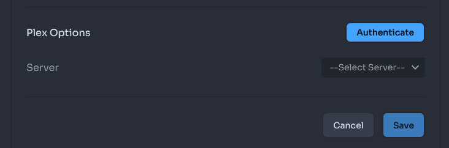
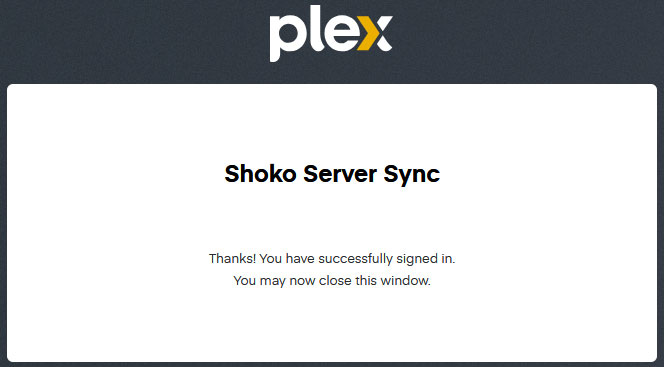

import EasyTable from "../../../components/EasyTable/EasyTable";
import { Steps } from '@astrojs/starlight/components';

Both Shoko Metadata and Shoko Relay are capable of syncing watched states from Plex to Shoko using a variety of methods which will be detailed below.

#### Using the "Sync Plex Watch Status" Action

Before you continue, make sure that you have a populated Library in Plex which utilizes a [Shoko Agent/Scanner](../installing-agents-scanners) combo.

<Steps>
1. Authenticate Plex
    - Navigating to **Settings** > **Metadata Sites** in the Shoko Server Web UI. 
    - Scroll down to **Plex Options** at the bottom and click **Authenticate**.
    
    - It will redirect you and have you log into your Plex account.
    - If successful, you'll see the following message.
    
2. Select Your Plex Server and Libraries
    - Return to **Settings** > **Metadata Sites** in the Shoko Server Web UI.
    - The Server dropdown in the Plex section should now be available.
    - Select your Plex Server and then any Libraries you would like to sync.
    - Hit Save.
3. Configure Plex Users
    - **CURRENTLY UNAVAILABLE FROM THE WEBUI**
</Steps>

:::caution[Warning]
Currently the "Sync Plex Watch Status" action doesn't function with cross platform setups e.g. Windows for Plex and Unix for Shoko at the same time.
:::

#### Using Webhooks (Plex Pass)

If you are a Plex Pass user, you can use Webhooks to forward scrobble events to Shoko Server. It is still mandatory to set the Plex Username as detailed in the [steps above](#using-the-sync-plex-watch-status-action). This way you don't need to run the "Sync Plex Watch Status" action manually.

:::caution[Warning]
Currently this only works with regular Episodes. Special, Other, ThemeSong, Trailer, Parody, and Movie Type episodes can not be detected and won't update their status.
You will need to run the "Sync Plex Watch Status" action, mark them as watched by hand in the Shoko WebUI, or use a utility script.
:::

To set up a Webhook, open your Plex WebUI and go to Settings (wrench icon). Under your username in the left menu, Select **Webhooks**.

Click the button to add a Webhook and enter your Shoko Server URL: `http://<shoko-server-ip>:8111/plex` (replace `<shoko-server-ip>` accordingly).

Save your changes. Now when playing an episode (with everything was set up correctly), you should see scrobble events in your Shoko Server Log.

#### Using a Utility Script (Advanced)


Configuration instructions are available on the [Shoko Relay Utility Scripts](../shoko-relay-utility-scripts) page. Once `config.py` has been properly filled out the [Watched-Sync](../shoko-relay-utility-scripts/#watched-sync) script can be run on a demand using task scheduler, cron, or an equivalent.

:::note
Syncing via utility script is the most robust method as it works cross platform, and with any episode type. As a caveat, it also requires the most effort to set up (basic knowledge of using python scripts is required).
:::

As an example, running the following command on a daily schedule would automatically sync all Plex watched states to Shoko until the schedule is removed.

```sh
watched-sync.py 1d
```
