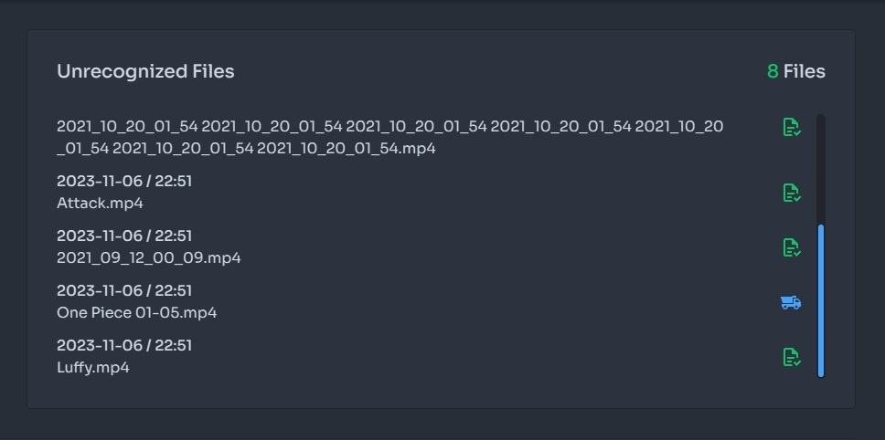
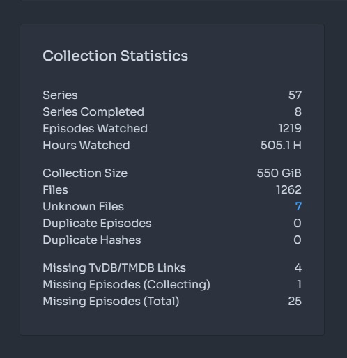
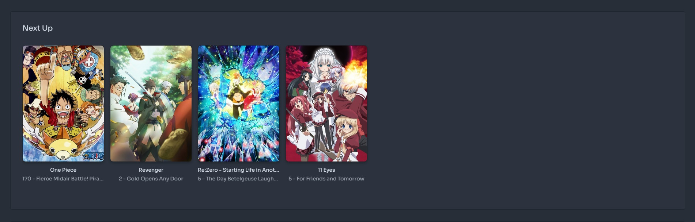
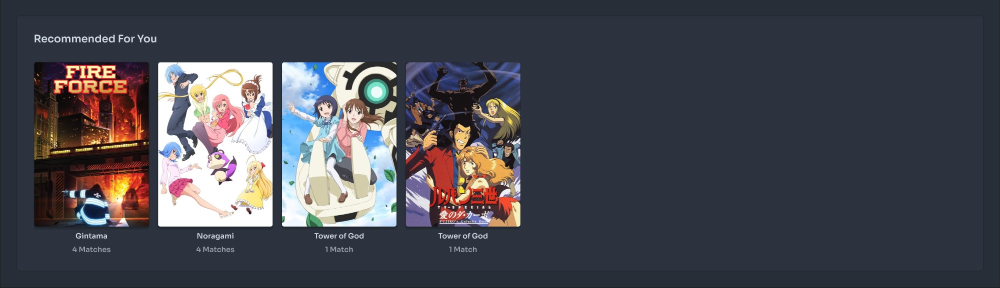
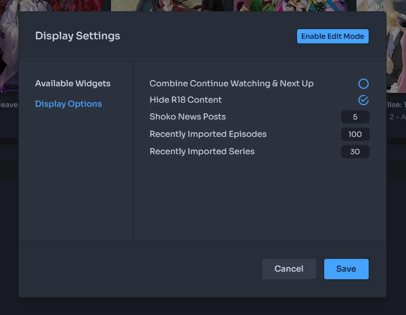

import EasyTable from "@components/EasyTable/EasyTable";

The Web UI Dashboard serves as a general overview of your collection, featuring multiple widgets designed to provide a
quick overview of various information related to your collection, including import status, current watch status,
and upcoming episodes, among others.

## Queue Processor

The Queue Processor optimizes task management for your collection by intelligently allocating tasks across a dynamic
pool of workers, enhancing efficiency and throughput.

### Dynamic Worker Allocation

Based on your system's capabilities, specifically the CPU thread count plus two, the Queue Processor adjusts the number
of workers to handle tasks efficiently. This scalable approach ensures optimal resource use, adapting to the workload
in real-time.

### Task Prioritization

A key feature of the Queue Processor is its ability to prioritize tasks effectively. It organizes tasks by type and
dynamically adjusts priorities to address external constraints, such as rate limitations. This means tasks potentially
slowed down by external factors are identified and de-prioritized, allowing other ready-to-run tasks to proceed. This
strategy prevents bottlenecks caused by "stuck" tasks, ensuring a smooth and continuous workflow, and enhances the
overall productivity by reducing idle worker time.

## Unrecognized Files

Unrecognized files are those that have been successfully hashed but failed to find a match in AniDB's hashing database
for various reasons. If you have a few files that need to be processed, clicking on the **Dump Truck** icon will initiate
the AVDump process. After it's completed, you can click on the **Checkmark File** icon to copy the ED2K and proceed with
dumping the file on AniDB.

For those dealing with a larger number of files or wanting to ensure there are no hashing issues, we recommend using
the Unrecognized Utility.

## Recently Imported

After a file has been successfully matched, the corresponding episode will appear in the Recently Imported widget,
displaying the last **20** episodes imported by default. Clicking the **Series** tab on the upper-right will display the
last **20** series imported by default. It's important to note that series are not duplicated in this view. So, if you
import an episode of a show one week and then another the next week, the series entry will be moved up but not
shown twice.

## Collection Statistics

Collection Statistics, as the name suggests, offer a summary of various information about your collection, divided
into three distinct sections. The first section lists the number of episodes and series in your collection, along
with the total hours you've watched. The second section displays your cumulative file size and provides indicators
for any unknown, multiple, or duplicate files. The final part provides information about missing metadata and
episode numbers, giving you a quick overview.

## Media Type

Media Type is represented by a simple horizontal bar chart that breaks down the various series in your collection
by type, listing the number of each type and their overall percentage of your collection.

## Import Folders

Import Folders allows you to add/edit import folders and while listing all available import folders used in your
collection. Import folders can be added by clicking the **folder plus** icon located in the panel header, and each
listed import folder has its own set of actions, Rescan Folder and Edit Folder.

The first action, **Rescan Folder**, will rescan every file within the folder itself. This is useful if, for some reason,
and depending on your settings, files added to that import folder were not automatically detected.

The second action, **Edit Folder**, allows you to edit the selected import folder by changing its name, location,
drop type, and watch indicator. You can refer to the table below for more information on each setting."

### Import Folder Options

<EasyTable
  header={['Name', 'Description']}
  data={[
    [
      'Name',
      'The name assigned to the import folder used for visual purposes only.',
    ],
    [
      'Location',
      'The actual location of the import folder, relative to where Shoko is installed.',
    ],
    [
      'Drop Type',
      'Tells Shoko how to handle this folder when it comes to processing your files. **Source** tells Shoko to grab files and move them another import folder marked as **Destination** while **Both** tells Shoko to perform the moving actions but not actually move the files. This allows files to be renamed on import and if using a custom renamer, whatever else it specifies. Lastly, **none** tells shoko to not do anything with the folder, this is usually paied with **Watch For New Files** set to **Yes**.',
    ],
    [
      'Watch For New Files',
      'A true/false setting which tells Shoko to monitor the import folder for new files. If set to **no**, you\'ll have to use the **Import Files** action to update your collection.'
    ],
  ]}
  center={true}
  columnWidths={{ Name: '30%', Description: '70%'}}
/>

## Shoko News

"As the name suggests, this panel displays the latest news from the Shoko blog. We highly recommend checking it
out whenever a new blog post is added. Not checking it out might just hurt our feelings

## Continue Watching

Continue Watching is a list of episodes that you've started watching but, for some reason, never finished. It
displays the series name, episode name, and a progress bar to gauge how much of the episode is left. Please note
that this information comes from external media players that use their Shoko-adjacent plugin. There might be
additional settings within that plugin that need to be configured for in-progress episodes to appear here.

## Next Up

Next Up is similar to Continue Watching, but displays the next unwatched episode in a series you are currently
watching. Just like Continue Watching, this section's information is sourced from external media players that
utilize their Shoko-adjacent plugin. Please keep in mind that there might be additional settings within that
plugin that need to be configured for in-progress episodes to appear here.

## Upcoming Anime

Upcoming Anime is a mini-calendar that tracks **currently airing** shows you are watching and displays the date for
the next airing episode. You can also access a week-long calendar by clicking on the All tab in the upper-right
corner. Please note that the number of days in the week view is currently hardcoded with no plans to change it at
the moment. Additionally, if **Hide R18 Content** is unchecked, you will see adult titles in this list.

## Recommended Anime

Recommended Anime uses an internal algorithm to recommend new series to watch based on what you've previously
watched. Currently, this recommendation system only applies to series within your collection, so it's not
uncommon for smaller series to have this section empty.

## Display Settings

Display Settings allow you to change what widgets are on your dashboard, certain widget properties and even the
layout of the dashboard itself.

To modify the dashboard layout, click the blue **Enable Edit Mode**  button. In this mode, you can freely move and
resize the widgets by selecting the arrow in the bottom-right corner. Most widgets can be any size you'd like,
so feel free to get creative. Once done, click the **Save** button to apply your new dashboard layout, or the
**Cancel** button if you've changed your mind. If you feel like you've made a mistake and no longer like your new
layout or want the original layout back, click the **Default** button in the floating edit panel.

The first section **Available Widgets** lists every widget available and a corresponding indicator to either show or
hide it. Making changes here can create unique gaps in your dashboard layout so make sure to edit it after to resolve
any issues.

The second section **Display Options** has various widget-related settings which are outlined below.

<EasyTable
  header={['Name', 'Description']}
  data={[
    [
      'Combine Continue Watching & Next Up',
      'As the name suggests, enabling this setting will combine these two sections. Leaving a modified Continue Watching widget that display both sets of information. ',
    ],
    [
      'Hide R18 Content',
      'Checked by default, when unchecked, series with the R18 tag will show in every widget where applicable.',
    ],
    [
      'Shoko News Posts',
      'Allows you to define how many news posts from the Shoko site to show, feel free to set it to 100.',
    ],
    [
      'Recently Imported Episodes',
      'Allows you to define how many episodes are shown in the Recently Imported widget. There is a max limit of 100 and will default to 100 if set to anything higher.',
    ],
    [
      'Recently Imported Series',
      'Allows you to define how many series are shown in the Recently Imported widget. There is a max limit of 100 and will default to 100 if set to anything higher.',
    ],
  ]}
  center={true}
  columnWidths={{ Name: '25%', Description: '75%'}}
/>
