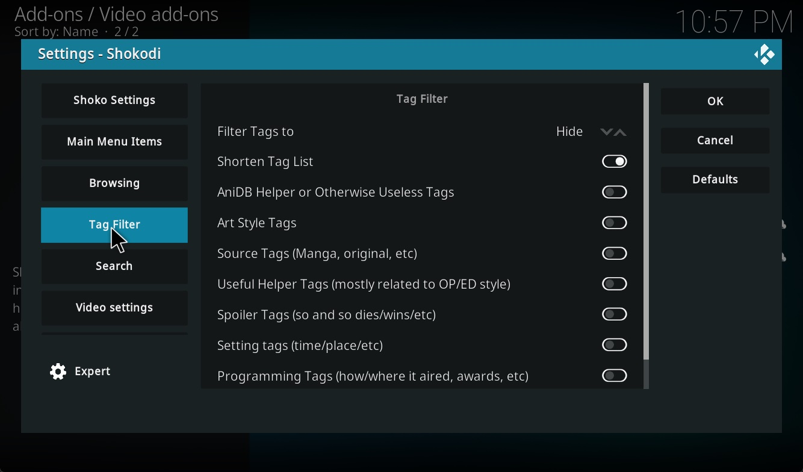
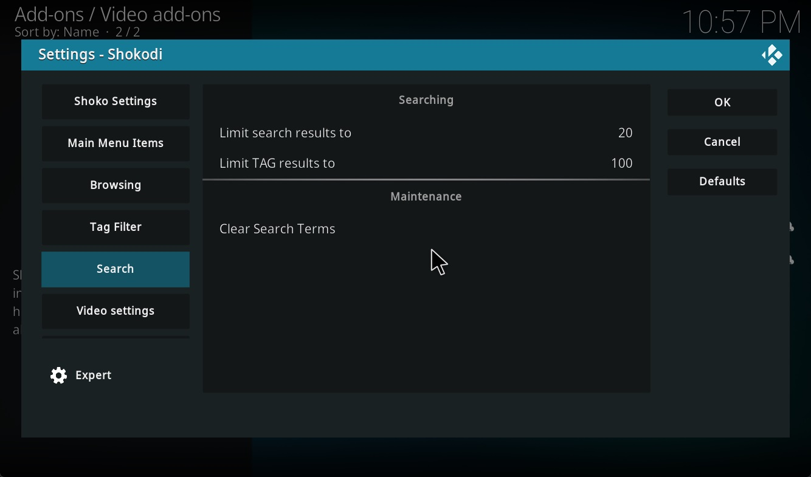

import ImageComponent from "@components/ImagePopup.astro";
import EasyTable from "../../../components/EasyTable/EasyTable";

Now that Shokodi is installed, you'll be spending the next five minutes configuring it to your preferences. The goal
is to make it that once you've completed this setup, you won't need to make any more changes for the foreseeable future,
unless you choose to do so.

## Opening Shokodi Settings

While viewing the list of your installed video add-ons, right-click on Shokodi and choose the **Settings** option.
If you accidentally clicked on Shokodi itself, you'll receive an error notification indicating either the inability
to locate the Shoko Server or login issues.

### Shoko Settings

The Shoko Settings section should be considered the **First Run** steps. You'll need to run both the
**Connection Wizard** and the **Login Wizard** to allow Shoko and Shokodi to connect. Refer to the table below
for the required information

<EasyTable
  header={["Option", "Description"]}
  data={[
    ["IP Address", "The IP address for the computer Shoko Server is on."],
    ["Port", "The port Shoko Server us using."],
    ["Port", "The port Shoko Server us using."],
    ["Username", "Your Shoko username."],
    ["Username", "Your Shoko password."],
  ]}
  columnWidths={{ Option: "25%", Description: "75%" }}
/>

### Main Menu Settings

The Main Menu section will display the listed options on Shokodi's main menu if toggled, along with your filters.

<EasyTable
  header={["Option", "Description"]}
  data={[
    ["Show Search", "Will show the search option on the menu."],
    ["Show Unsorted",  "Will show the unsorted files option on the menu that lists all unrecognized files."],
  ]}
  columnWidths={{ Option: "25%", Description: "75%" }}
/>

### Browsing Settings

The Browsing section contains various display-related and context menu settings for how your collection will be
presented within Shokodi. Please note that not all available settings are covered below; only the ones with the
most significant impact are discussed. The remaining settings should be self-explanatory.

<EasyTable
  header={["Option", "Description"]}
  data={[
    ["Use Server Title", "When toggled, will use the settings as defined in Shoko Server."],
    ["Language", "The language to show titles in, only available when Use Server Title is not toggled."],
    ["Title Type", "Determines the source for the title shown, only available when Use Server Title is not toggled."],
    ["Fix Desynced Watched Status in Kodi Database", "When ran, will update the Kodi database with watched state info from Shoko."],
    ["Fix Desynced Images in Kodi Database", "When ran, will forcefully update all series images to match what Shoko has."],
  ]}
  columnWidths={{ Option: "25%", Description: "75%" }}
/>

### Tag Filter Settings

The Tag Filter section allows you to specify the corrective actions you wish to apply to the series tags sent from
Shoko. This includes actions like hiding spoiler tags and removing unnecessary tags. Since these actions are
self-explanatory, we will focus on explaining the filter setting.

<EasyTable
  header={["Option", "Description"]}
  data={[
    ["Filter Tags To", "Will either show toggled tag filter items, or hide them. In the above example, only Shorten Tag List will be active."],
  ]}
  columnWidths={{ Option: "25%", Description: "75%" }}
/>

### Search Settings

The Search Settings section sets the maximum limit for the number of tags and general search results for your query.
It's advisable not to input higher numbers, as doing so may result in unforeseen issues.

### Video Settings

The Video Settings section, which is also referred to as the Watched Status settings section, encompasses a range of
options related to watch states, series voting, Trakt integration, and general Kodi player settings. These options
are all fairly self-explanatory, so there's no need to single out any specific ones for emphasis.

### Advanced Settings

The Advanced Settings section is typically reserved for troubleshooting and should generally be left untouched.
However, there are two settings related to Seiyuu that are worth mentioning.

<EasyTable
  header={["Option", "Description"]}
  data={[
    ["Disable Kodi's Internal Cast Menu", "If enabled, will not display the episode cast information."],
    ["Use Seiyuu Picture For Case Data", "If enabled, will use the Seiyuu images downloaded by Shoko."],
  ]}
  columnWidths={{ Option: "25%", Description: "75%" }}
/>
